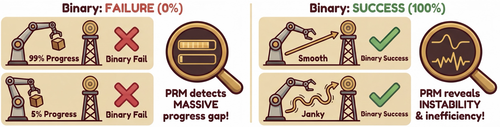
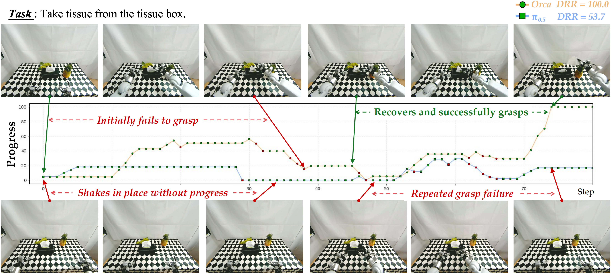
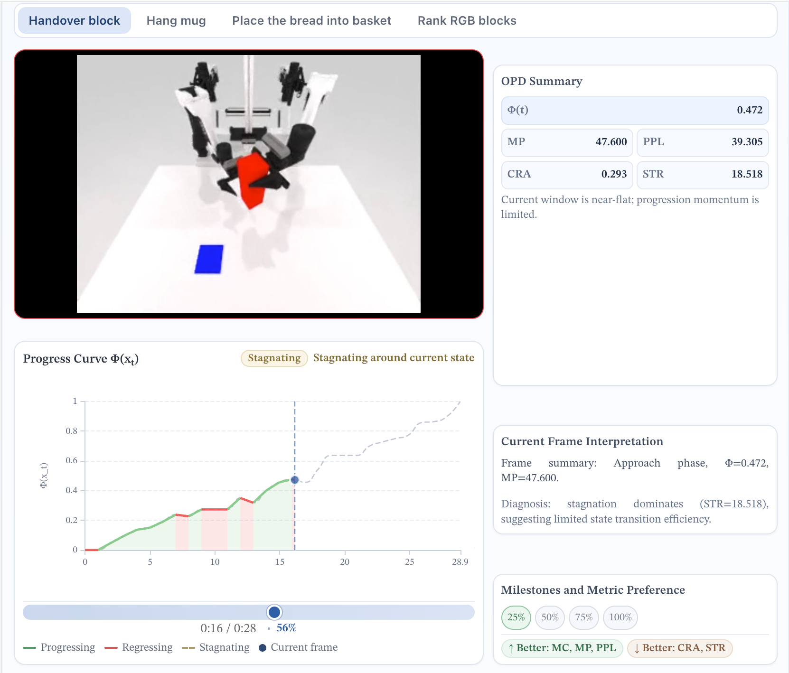
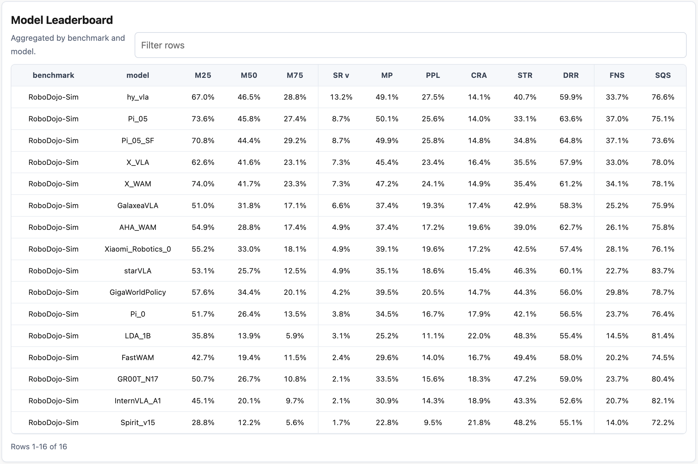
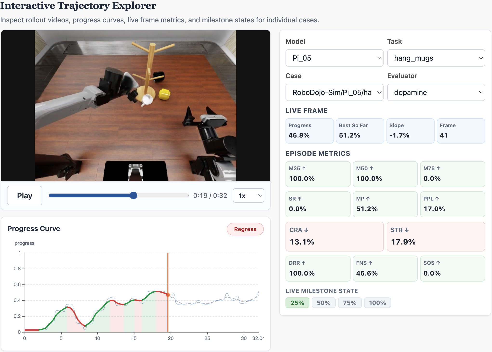

<h1 align="center">
  
  PRM-as-a-Judge 1.5:<br>
  A Practical Toolkit for Robot Process Auditing
</h1>

<h3 align="center">Beyond pass/fail, toward process-level robot evaluation.</h3>

<p align="center">
  <a href="https://arxiv.org/abs/2603.21669"></a>
  &nbsp;
  <a href="https://prm-as-a-judge.github.io/"></a>
  &nbsp;
  <a href="https://prm-as-a-judge.github.io/doc.html"></a>
  &nbsp;
  <a href="https://prm-as-a-judge.github.io/blog.html"></a>
  &nbsp;
  <a href="https://prm-as-a-judge.github.io/leaderboard.html"></a>
  &nbsp;
  
  &nbsp;
  <a href="https://huggingface.co/tanhuajie2001/Robo-Dopamine-GRM-2.0-8B-Preview"></a>
  &nbsp;
  <a href="LICENSE"></a>
</p>

<p align="center">
  <a href="#wechat-community">
    
  </a>
</p>


## 🔥 Updates

> 📢 **Call for Collaboration**
>
> We warmly welcome researchers and benchmark teams to apply PRM-as-a-Judge to their own embodied task evaluations. We are happy to provide hands-on guidance on rollout preparation, metric interpretation, and evaluation integration. Please contact us through the WeChat group below or by email at `liuyuyang2025@ia.ac.cn`.

- **`2026-08-14`**: 📝 **PRM-as-a-Judge 1.5 technical report released:** Our new report, [PRM-as-a-Judge 1.5: A Toolkit for Robot Process Assessment](https://arxiv.org/abs/2608.14284), presents expanded metrics, representative case studies, **RoboPulse++**, and a reproducible robot process assessment suite.
- **`2026-07-19`**: 📖 **Official User Guide released for easier onboarding:** Published a step-by-step [Quick Start and Advanced Guide](https://prm-as-a-judge.github.io/doc.html) to help users run the complete workflow from installation and demo evaluation to visualization and advanced configuration.
- **`2026-07-13`**: 📊 **Major visualization upgrade:** Released an interactive evaluation report system with model- and task-level dashboards, failure diagnostics, and synchronized rollout video–progress inspection through `prm-judge visualize`.
- **`2026-07-10`**: 📏 **Major metric-system upgrade:** Introduced an expanded trajectory-level metric framework for evaluating progress quality, stagnation, regression, recovery, and failure characteristics beyond conventional success rates.
- **`2026-07-09`**: 🤝 **External adoption:** [Orca](https://orca-wm.github.io/#change) adopted PRM-as-a-Judge for action-generation evaluation, demonstrating its value as a dense diagnostic complement to conventional success-rate metrics.
- **`2026-03-30`**: 🤗 The [RoboPulse benchmark page](https://huggingface.co/datasets/yuheng2000/RoboPulse) is now online on Hugging Face.
- **`2026-03-27`**: 🚀 PRM-as-a-Judge evaluation with PRM backends is now open in this repo. Start with [Robo-Dopamine](https://huggingface.co/tanhuajie2001/Robo-Dopamine-GRM-2.0-8B-Preview) and try it on your own rollouts.
- **`2026-03-23`**: 📝 PRM-as-a-Judge blog and arXiv paper are released. See methodology, OPD definitions, and demos in the [technical blog](https://prm-as-a-judge.github.io/blog.html).
- **`2026-03-20`**: 🏆 RoboChallenge Table30 leaderboard results are released on the [leaderboard page](https://prm-as-a-judge.github.io/leaderboard.html).

## 🧭 Why Fine-Grained Robotic Auditing?

Binary success rate creates two blind spots:

- `99%` progress and `5%` progress can both become the same `failure`.
- Smooth success and janky success can both become the same `success`.

PRM-as-a-Judge addresses exactly this problem: instead of reducing a rollout to one final bit, it audits how far the policy got, how it moved, and where it broke down.

<p align="center">
  
</p>

## 🔍 Auditing with PRM-as-a-Judge

Once a judge has both macro and micro resolution, PRM-as-a-Judge can turn a rollout into interpretable auditing signals.

In the example below, both policies attempt to take a tissue from the box. PRM-as-a-Judge reveals clear differences in their execution processes: Orca initially fails to grasp but recovers and completes the task, while π0.5 spends long periods shaking in place and repeatedly fails to grasp. A binary success/failure result would not capture these differences in progress, recovery, and execution quality.

<p align="center">
  
</p>

Want to inspect trajectories frame by frame? The blog includes an interactive explorer with progress curves, metric summaries, and frame-level interpretations: [https://prm-as-a-judge.github.io/blog.html#interactive-trajectory-explorer](https://prm-as-a-judge.github.io/blog.html#interactive-trajectory-explorer)

<p align="center">
  <a href="https://prm-as-a-judge.github.io/blog.html#interactive-trajectory-explorer">
    
  </a>
</p>

## 📊 Evaluation Metrics

By default, the metrics below are computed from the processed progress curve after outlier handling and smoothing. The raw curve is retained in the outputs for inspecting the PRM's direct predictions and troubleshooting.

**↑** means higher is better; **↓** means lower is better.

| Metric | Interpretation |
| --- | --- |
| **MP ↑** | Maximum progress reached. A higher value means the rollout came closer to completing the task. |
| **M25 ↑ / M50 ↑ / M75 ↑** | Whether a rollout reached the 25%, 50%, and 75% progress milestones; aggregates report the proportion of rollouts reaching each milestone. |
| **SR ↑** | Whether a rollout reached the success threshold, which defaults to `0.99`; aggregates report the success rate. |
| **PPL ↑** | Measures path efficiency while making progress. Higher values indicate that useful progress is more concentrated. |
| **CRA ↓** | Measures cumulative loss caused by regressions. Lower is better; compare rollouts that reached similar progress. |
| **STR ↓** | Fraction of steps with almost no progress change. Lower values indicate less stagnation. |
| **DRR ↑** | Measures recovery after the largest progress regression. Aggregate DRR averages only trajectories that actually regress; higher values indicate more complete recovery. |
| **FNS ↑** | Measures how close a failed rollout came to success by combining its highest progress and milestone completion. |
| **SQS ↑** | Measures execution quality among successful rollouts, rewarding efficient, low-regret, and low-stagnation behavior. |

For metric scopes, formulas, and configuration details, see [Evaluation Metrics in the Advanced Guide](https://prm-as-a-judge.github.io/advanced.html#metrics).

A trajectory is considered to have regressed when its processed progress falls more than `1e-12` below a previous peak; this tolerance excludes floating-point tail noise. Reports leave per-case DRR blank when no such regression occurs.

## 🚀 Quick Start

Describe each rollout case in a JSONL manifest, then run one command to evaluate the complete set.

Evaluate three bundled robot rollout cases with a Process Reward Model (PRM) and generate progress curves, metrics, summaries, and an interactive report.

### Choose a Workflow

```text
Bundled videos & tasks → Judge Model → progress curves → metrics & report
```

#### Notebook

Run the complete workflow cell by cell, inspect the cases, and open the generated report.

[Open the Notebook](getting_started/PRM_as_a_Judge_quickstart.ipynb)

#### Command Line

Follow the steps below to run the same example with the standard shell entry point.

### Run the Bundled Demo

#### 1. Clone the repository

```bash
git clone https://github.com/Yuheng2000/PRM-as-a-Judge.git
cd PRM-as-a-Judge
```

#### 2. Create and activate the environment

```bash
conda create -n prm-judge python=3.10 -y
conda activate prm-judge
```

#### 3. Install the demo dependencies

```bash
python -m pip install --upgrade pip
python -m pip install -e ".[dopamine]" \
  -c constraints/dopamine-cu128-py310.txt
python -m pip check
```

#### 4. Download the checkpoint

The bundled demo uses [Robo-Dopamine-GRM-2.0-8B-Preview](https://huggingface.co/tanhuajie2001/Robo-Dopamine-GRM-2.0-8B-Preview) as its default PRM checkpoint.

```bash
PRM_PATH=$(hf download tanhuajie2001/Robo-Dopamine-GRM-2.0-8B-Preview)
```

#### 5. Evaluate all three cases

```bash
MANIFEST=eval/examples/manifest_demo_cases.jsonl \
PRM_PATH="$PRM_PATH" \
VISUALIZE=1 \
bash eval/run_eval.sh
```

The final terminal line prints the generated run directory.

The default evaluation mode is `incremental`. Override it only when required with `EVAL_MODE=forward` or `EVAL_MODE=backward`. Each evaluation is defined by an explicit JSONL manifest.

#### 6. Open the interactive report

```bash
python eval/run_judge.py serve \
  --run-root eval/results/run_YYMMDD_HHMMSS
```

After the run completes, open the report URL printed by the command. The final performance report includes the Model Leaderboard shown below, which summarizes the core metrics for every evaluated model. You can also use the interactive report to filter and inspect every case, including its rollout video, progress curve, and per-case metrics.

<p align="center">
  <a href="figs/report-metrics-overview.webp">
    
  </a>
</p>

<p align="center"><strong>Final performance report.</strong> The Model Leaderboard provides the final model-level performance summary for the evaluation run.</p>

<p align="center">
  <a href="figs/report-trajectory-explorer.webp">
    
  </a>
</p>

<p align="center"><strong>Interactive trajectory explorer.</strong> Inspect rollout videos together with progress curves, live-frame values, per-case metrics, and milestones.</p>

The report also supports case-level inspection in the interactive trajectory explorer. Every completed run writes `metrics.xlsx` with `Cases`, `Task Summary`, `Model Summary Mean`, and `Model Summary Median` sheets. See the [Advanced Guide](https://prm-as-a-judge.github.io/advanced.html#outputs) for the complete visualization reference.

#### 7. Evaluate your own rollout

Create a JSONL manifest containing a case ID, task description, and video path:

```json
{"case_id":"case_001","task":"put the can into the basket","video":"videos/case_001.mp4"}
```

```bash
MANIFEST=/path/to/cases.jsonl \
PRM_PATH="$PRM_PATH" \
VISUALIZE=1 \
bash eval/run_eval.sh
```

Configure additional views, evaluation modes, GPUs, curve processing, metrics, or another PRM in the [Advanced Guide](https://prm-as-a-judge.github.io/advanced.html).

## 🎯 TODO

- [x] Release the [project homepage](https://prm-as-a-judge.github.io/), [blog](https://prm-as-a-judge.github.io/blog.html), and [leaderboard](https://prm-as-a-judge.github.io/leaderboard.html).
- [x] Release RoboChallenge Table30 OPD results on the [online leaderboard](https://prm-as-a-judge.github.io/leaderboard.html).
- [x] Release the [evaluator inference toolkit](#-quick-start) for offline trajectory scoring.
- [x] Release standardized [RoboPulse](https://huggingface.co/datasets/yuheng2000/RoboPulse) access and evaluation protocol.
- [ ] Release the PRM-as-a-Judge 1.5 technical report, featuring expanded metrics, representative case studies, and our new trajectory-level benchmark, **RoboPulse++**. ***(Coming soon; expected in about 2 weeks.)***
- [ ] Release PRM-as-a-Judge 2.0 with a new Judge Model that is **faster, stronger, more practical**, and requires no additional compute resources. ***(Coming soon; expected in about 2–3 months.)***

## ❓ FAQ

### 1. What is `goal_image` used for?

`goal_image` is an ***optional parameter*** specific to **Robo-Dopamine**. It provides an **explicit visual reference for the completed task state**, helping the model understand what success should look like, reduce goal ambiguity, and improve progress-judgment accuracy. **Robo-Dopamine** uses it as `REFERENCE END`; in `backward` mode, the goal image is also compared directly with the current sampled state. *Other Judge Model adapters do not necessarily use this field.*

In practice, set `goal_image` in the manifest when a **reliable success-state reference** is available, preferably *the final frame of a manually verified successful demonstration* or *a separately captured target state*. If no reliable goal image is available, omit the field; the **Robo-Dopamine** adapter will use `eval/examples/blank.png` as a placeholder, although the evaluation will not benefit from an explicit goal reference. **Do not use the final frame of the rollout being evaluated unless that rollout is known to have succeeded**, because a failure state could otherwise be treated as the task goal and reduce judgment accuracy.

### 2. How does Robo-Dopamine estimate progress, and when should I use another PRM as the judge?

**Robo-Dopamine** is a ***pair-wise Judge Model***. Depending on `EVAL_MODE`, it compares two sampled images or states—for example, adjacent samples, the initial state and the current state, or the current state and a goal reference—to estimate relative progress. These pair-wise judgments are then linked into a progress curve.

This local comparison works well for many robot manipulation tasks. **However, it can be ambiguous for repeated or oscillatory motions and tasks that depend strongly on temporal context.** Two images alone may not reveal whether the robot is making sustained progress, repeating an action cycle, or simply moving back and forth. For these tasks, consider a ***sequence-style PRM*** that evaluates a longer video sequence, such as **RoboMeter**, or use it as a comparison.

<a id="wechat-community"></a>

## 💬 WeChat Community

If you'd like to discuss PRM-as-a-Judge, benchmark setup, or rollout evaluation with us, you're very welcome to join the WeChat group.

<details>
  <summary><strong>Show WeChat Group QR Code</strong></summary>
  <br>
  <p align="center">
    
  </p>
  <p align="center">
    <sub>Scan the QR code above to join the community chat.</sub>
  </p>
</details>

## 📑 Citation

If this project, leaderboard, or evaluation pipeline helps your work, please cite:

```bibtex
@article{ji2026prmjudge,
  title   = {PRM-as-a-Judge: A Dense Evaluation Paradigm for Fine-Grained Robotic Auditing},
  author  = {Ji, Yuheng and Liu, Yuyang and Tan, Huajie and Huang, Xuchuan and Huang, Fanding and Xu, Yijie and Chi, Cheng and Zhao, Yuting and Lyu, Huaihai and Co, Peterson and others},
  journal = {arXiv preprint arXiv:2603.21669},
  year    = {2026}
}
```

## 🤝 Collaboration and Open Evaluation

We welcome collaboration with ***benchmark teams*** and ***model developers***. If you can share rollout videos, we are happy to audit them and help build a more transparent robotics evaluation stack. Contact: `liuyuyang2025@ia.ac.cn`
